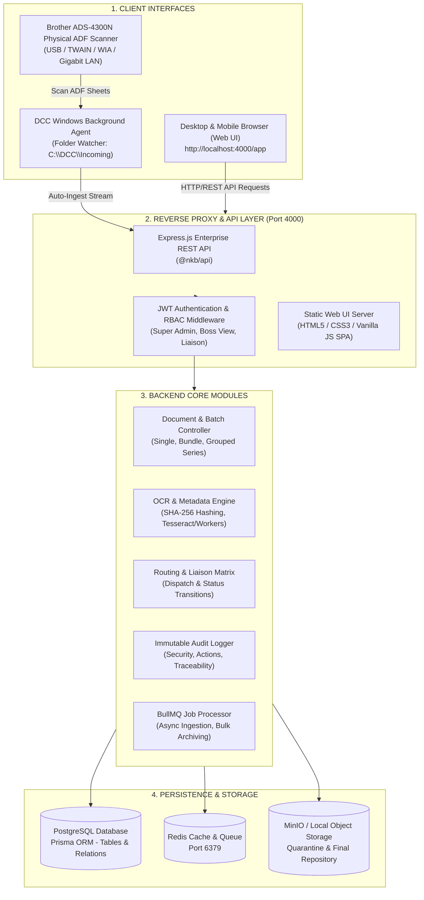
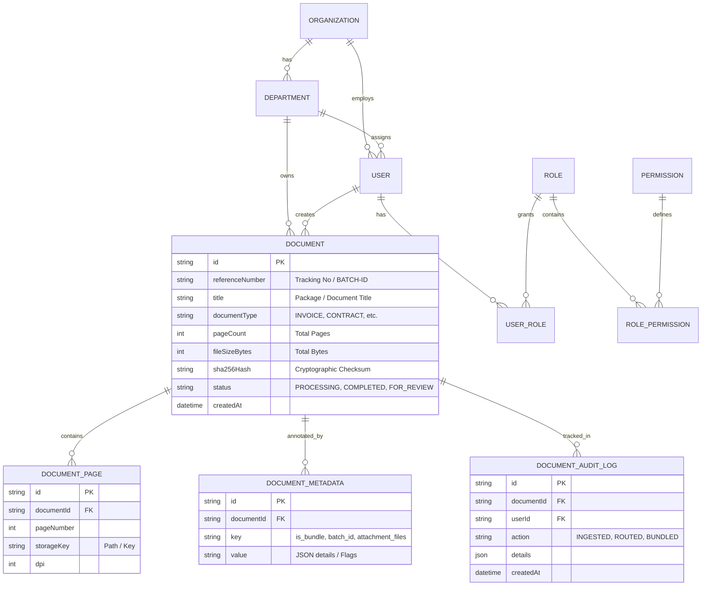
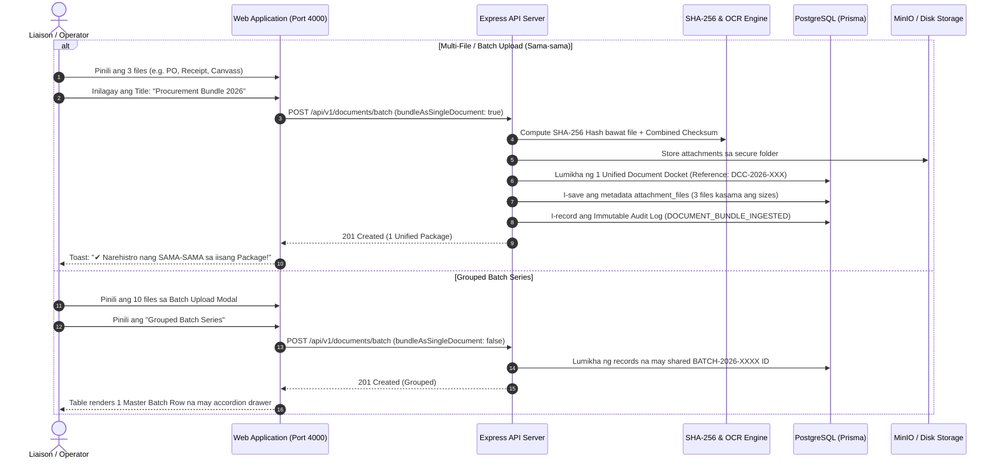

# DCC (Document Control Center) Enterprise WebApp — Walkthrough & Architectural Blueprint

Ang dokumentong ito ay naglalaman ng komprehensibong **Blueprint** (arkitektura ng system, database, at daloy ng datos) at **Walkthrough** (gabay sa paggamit ng bawat module at tab sa Web Application).

---

## BAHAGI 1: ARCHITECTURAL BLUEPRINT (ARKITEKTURA NG SISTEMA)

### 1.1 High-Level System Architecture

Ipinapakita sa diagram sa ibaba kung paano konektado ang Web Frontend, API Backend, Database, Object Storage, at Hardware Scanner Integration:

---

### 1.2 Database & Entity Relationship Model (ER Blueprint)

Ang database schema ay binuo gamit ang **Prisma ORM** sa ibabaw ng PostgreSQL. Narito ang kaugnayan ng mga pangunahing talahanayan:

---

### 1.3 Role-Based Access Control (RBAC) Matrix

Upang masiguro ang seguridad ng impormasyon, may tatlong antas ng access ang sistema:

| Kakayahan / Feature | Super Admin (`SUPER_ADMIN`) | Boss View (`DEPARTMENT_USER`) | Liaison Officer (`VIEWER`) |
| :--- | :---: | :---: | :---: |
| **Dashboard & KPIs** | Buong Sistema (Lahat ng Departamento) | Sa Kanyang Departamento Lamang | Operational View |
| **Documents Master View** | Lahat ng Dokumento | Sariling Departamento Lamang | Lahat ng Dokumentong Hawak |
| **Batch / Multi-File Ingestion** | Pinapayagan | Read-only | Pinapayagan |
| **Document Routing / Dispatch** | Pinapayagan | Read-only / Monitor | Pinapayagan |
| **Archive & SHA-256 Inspection** | Full Access & JSON Export | View Logs Lamang | Restricted |
| **User Accounts Management** | **EKSKLUSIBO (Add/Edit/Delete/Link)** | Nakatago (Access Denied) | Nakatago (Access Denied) |
| **Danger Zone (Reset Back to Zero)**| **EKSKLUSIBO (Password Protected)** | Nakatago (Access Denied) | Nakatago (Access Denied) |
| **Scanner Watch Folder (`C:\DCC`)** | Maaaring I-monitor / I-configure | Hindi Naa-access | Hindi Naa-access |

---

## BAHAGI 2: DALOY NG DOKUMENTO (DOCUMENT LIFECYCLE PIPELINE)

Kapag nagpasok ng dokumento sa DCC, ganito ang pinagdaraanan nito:

---

## BAHAGI 3: COMPREHENSIVE WEBAPP WALKTHROUGH (GABAY SA PAGGAMIT)

### 3.1 Pag-login sa WebApp
1. Buksan ang browser sa: **[http://localhost:4000/app](http://localhost:4000/app)**
2. Gamitin ang naaangkop na account:
   * **Super Admin**: `admin@nkb-scanning.local` o `admin@dcc.gov.ph`
   * **Password**: `Admin@NKB2026!Secure` o `AdminPass123!`
3. Kapag naka-login, makikita ang kaliwang sidebar na may 9 na active modules.

---

### 3.2 Walkthrough ng Bawat Tab sa Sidebar

#### 1. 📊 Dashboard (`#dashboard`)
* **Live KPI Cards**:
  - *Total Documents*: Kabuuang bilang ng mga aktibo at nakaimbak na dokumento.
  - *Incoming Documents*: Mga bagong pasok na transaksyon na kailangang aksyunan.
  - *Outgoing Documents*: Mga na-dispatch o natapos nang transaksyon.
  - *Pending Actions*: Mga dokumentong naghihintay ng QC approval o routing.
* **Quick Actions**: Mabilisang access sa `+ Register Document` at `+ Batch Upload`.
* **Recent Documents Table**: Live feed ng huling mga dokumentong pumasok sa repository.

#### 2. 📑 Documents Master View (`#documents`)
* **Lahat ng Dokumento sa Iisang Lugar**:
  - May filter bar para sa **Keyword Search** (pamagat o docket number), **Department Filter**, at **Status Filter**.
  - **Hindi na Hiwa-hiwalay**: Ang mga dokumentong in-upload nang sabay ay lalabas bilang **Isang Unified Package** (hal. `📦 PACKAGE (3 FILES SAMA-SAMA)`) o bilang isang **Master Batch Card** na may `▼ Ipakita (3 Files)` accordion drawer.
* **Row Controls**:
  - `View / View Package`: Bubuksan ang Document Dossier Inspector.
  - `Route`: Ipasa ang dokumento sa ibang departamento.
  - `Delete`: Burahin ang dokumento (may safety confirmation).

#### 3. 📥 Incoming Documents (`#incoming`)
* Nakalaan para sa mga bagong tanggap na dokumento mula sa panlabas o ibang opisina (`status !== 'COMPLETED'`).
* Dito minomonitor ng Liaison Officer ang mga papeles na kailangang i-review, rehistruhan ng karagdagang detalye, o i-forward.

#### 4. 📤 Outgoing Documents (`#outgoing`)
* Talaan ng mga opisyal na na-release, na-dispatch, o naaprubahan nang transaksyon (`status === 'COMPLETED'`).
* Naglalaman ng patunay ng transmittal at petsa kung kailan naipalabas ang dokumento.

#### 5. 🔀 Document Routing (`#routing`)
* **Liaison Dispatch Matrix**:
  - Malinaw na ipinapakita ang *Document Number*, *Title*, *Origin* (Pinanggalingan), *Target Destination* (Pupuntahan), at *Routing Status*.
* **Interactive Routing Modal**:
  - I-click ang `Route Document`.
  - Piliin ang Destination Department (Accounting, Purchasing, HR, Legal, atbp.).
  - Ilagay ang pangalan ng Receiving Officer at mga tagubilin (Remarks).
  - Pindutin ang `Submit Dispatch` — awtomatikong mag-a-update ang timeline ng dokumento.

#### 6. 📁 Folders (`#folders`)
* **Folder Cards ayon sa Departamento at Taon**:
  - Bawat folder card ay may live badge na nagpapakita kung ilang dokumento ang nasa loob nito.
* **Dynamic In-Place Filtering**:
  - I-click ang kahit anong folder (hal. `Accounting & Finance` o `Purchasing`).
  - Agad na sasalain ng talaan sa ibaba ang mga dokumentong nakatalaga lamang sa nasabing folder nang hindi umaalis sa page.
  - May `+ New Folder` button para lumikha ng pasadyang kategorya.

#### 7. 🏛 Archive (`#archive`)
* **Pangmatagalang Imbakan (Immutable Archival)**:
  - Listahan ng mga pinal at tapos nang dokumento na may kasamang cryptographic **SHA-256 Checksum Badge**.
* **Audit Logs Export (JSON)**:
  - May button sa kanang itaas: `Audit Logs (JSON)`.
  - Sa isang pindot lang, mada-download ang buong compliance log sa format na JSON para sa mga auditor o COA inspection.

#### 8. 🔍 Search Engine (`#search`)
* **Parametric at Full-Text Search**:
  - Mag-type ng kahit anong salita sa search input (pamagat, supplier, reference code, o tracking number).
  - Pindutin ang **Enter** sa keyboard o i-click ang `Search Records`.
  - Agad nitong sasalain ang database at ipapakita ang tumutugmang resulta.

#### 9. ⚙ Settings (`#settings`) — **Super Admin Exclusive**
* Kapag hindi Super Admin ang nag-access, awtomatiko itong magpapakita ng **"Access Denied"**.
* **Mga Tampok sa Super Admin Console**:
  1. **User Accounts & Access Management**:
     - Listahan ng lahat ng rehistradong user kasama ang kanilang email, full name, role, at departamento.
     - `+ Add User` modal: Lumikha agad ng bagong staff account.
     - `Edit`: Magpalit ng pangalan, departamento, o role (Super Admin, Boss View, Liaison).
     - `Delete`: Mag-deactivate o magbura ng account.
  2. **Preset Registration Link Generator**:
     - Piliin ang nais na Role (hal. *Boss View* o *Liaison Officer*).
     - I-click ang `Generate Link` — maglilikha ang system ng one-time registration link na may pre-assigned role para ibigay sa empleyado.
  3. **Scanner Watch Folder Monitor**:
     - Real-time status ng background scanner engine sa `C:\DCC\Incoming`.
  4. **Danger Zone — Reset Data (Back to Zero)**:
     - May multi-layer safety check at password confirmation bago linisin ang transaction records kung kinakailangang magsimula muli mula sa zero.

---

### 3.3 Paano Mag-Upload nang Maramihan (Sama-sama)

#### Paraan 1: Gamit ang "+ Register Document"
1. I-click ang **`+ Register Document`**.
2. Ilagay ang Pamagat ng Transaksyon (hal. `Disbursement Voucher - March 2026`).
3. Sa ilalim, sa **File Attachment(s)**, pumili ng **2 o higit pang files**.
4. Mapapansin ang berdeng abiso:  
   `✔ Multi-File Package (Sama-sama): X documents selected.`
5. I-click ang **`I-save ang Document Package (X Files Sama-sama)`**.
6. **Resulta**: Iisang Document Record lamang ang malilikha sa talaan na may badge na `📦 PACKAGE (X FILES SAMA-SAMA)`. Kapag clinic ang *View Package*, makikita ang bawat kalakip na file sa loob.

#### Paraan 2: Gamit ang Dedicated "+ Batch Upload" Modal
1. I-click ang **`+ Batch Upload`** sa header o toolbar.
2. I-drag at i-drop ang hanggang 100 na dokumento (PDF, DOCX, XLSX, Images) sa asul na kahon.
3. Ilagay ang **Batch Title / Package Name**.
4. Piliin ang Paraan ng Pag-Grupo:
   * **Sama-sama sa Isang Document Package (Recommended)**: Pagsasamahin ang lahat sa iisang Docket Number.
   * **Grouped Batch Series**: Bibigyan ng shared `#BATCH-XXXX` ID at naka-grupo sa isang expandable accordion drawer sa talaan.
5. Piliin ang Department at Document Type, pagkatapos ay i-click ang **`Register All Documents`**.
6. Panoorin ang real-time progress bar hanggang maging `100% Complete`.

#### Paraan 3: Diretsong Pag-drop sa Windows Folder (`C:\DCC\Incoming`)
* Para sa bultuhang scan mula sa hardware scanner, i-save lamang ang mga PDF sa `C:\DCC\Incoming`.
* Awtomatiko itong babasahin at ipapasok ng DCC Background Agent sa system repository nang walang manual upload.

---

## BUOD NG MGA DIREKTORYO AT SOURCE CODE

| Bahagi | Folder Path sa Computer |
| :--- | :--- |
| **Pangunahing Workspace** | `C:\Users\earlj\Desktop\DCC V2` |
| **Mirror Synchronized Backup** | `C:\Users\earlj\Desktop\DCC` |
| **Web Frontend Single-Page App** | `apps\web\public\index.html` |
| **REST API Server** | `apps\api\src\server.ts` & `src\modules\documents\` |
| **Prisma Database Schema** | `apps\api\prisma\schema.prisma` |
| **Hardware Scanner Watch Directory** | `C:\DCC\Incoming` |
