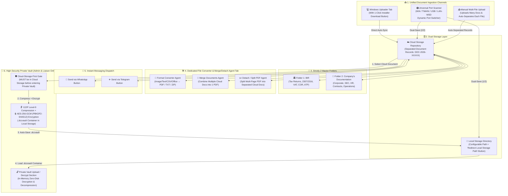

# Document Control Center (DCC) — System Concept Map, Architecture & Blueprint (v2.0)

## 1. Revised System Concept Map (v2.0)

---

## 2. Implemented Mechanics & Features

1. **Windows Uploader $\rightarrow$ Cloud Storage (with Download Button)**
   - Dedicated **Windows Uploader** tab (`windows-uploader`) with a **Download Windows Uploader (`DCC-Windows-Cloud-Uploader-Setup.zip`)** button (`GET /api/v1/converter/windows-uploader-download`).
   - Streams all watched desktop files directly to **Cloud Storage** as separated records.

2. **Universal Port Scanner $\rightarrow$ Local Storage AND Cloud Storage**
   - Dedicated **Scanner & Local Storage** tab (`scanner`) that detects and adapts to any scanner connected across ports (`USB001`, `USB002`, `WSD-LAN-192.168.1.50`, `TWAIN-VIRTUAL`, or any custom port) via `GET /api/v1/scanners/ports` and switches dynamically via `POST /api/v1/scanners/switch`.
   - Every scan (`POST /api/v1/scanners/scan`) dual-saves simultaneously to **Local Storage** (`<LocalStorage>/Scans/`) and **Cloud Storage** (`uploads/scans/`).

3. **Local Storage Path & Redirect Button**
   - Local Storage has its own dedicated path (`C:\DCC-LocalStorage` by default) with `<LocalStorage>/Scans` and `<LocalStorage>/PrivateVault` subdirectories.
   - Includes the **"Redirect Local Storage Path"** button (`POST /api/v1/scanners/local-storage`) to dynamically change and provision a new Local Storage directory at any time.

4. **Manual Multi-File Upload $\rightarrow$ Cloud Storage (Automatic Separation)**
   - Uploading multiple files in `POST /api/v1/documents` or `POST /api/v1/documents/batch` defaults to `bundleAsSingleDocument: false`, **automatically separating** every uploaded file into its own individual Cloud Storage document record (`DOC-2026-XXXXX`).

5. **Folders Tab Grouped into Strictly 2 Master Folders**
   - **`🏛️ BIR`**: Tax Returns, BIR Form 2307/2316, VAT Declarations, COR, ATP, and Tax Compliance records.
   - **`🏢 Company's Documentation`**: Corporate, SEC/GIS, Contracts, HR, Purchasing, Accounting, and Operations documentation.

6. **Dedicated Converter & Merge/Detach Agent & Tab**
   - Dedicated **Converter & Merge/Detach** tab (`converter`) powered by `/api/v1/converter`:
     - **Format Converter (`POST /api/v1/converter/convert`)**: Converts Cloud Storage files between `PDF`, `TXT`, and `ZIP` (from Images, Text, CSV, Office files, or PDFs).
     - **Merge Documents (`POST /api/v1/converter/merge`)**: Combines 2 or more Cloud Storage documents into a single unified PDF in Cloud Storage.
     - **Detach / Split Pages (`POST /api/v1/converter/detach`)**: Splits a multi-page PDF in Cloud Storage by page range (`ALL` or custom ranges like `1, 2-3`) into separated Cloud Storage documents.

7. **WhatsApp & Telegram Send Buttons**
   - Direct **`💬 WhatsApp`** and **`✈️ Telegram`** send buttons on every document row and inside the Document Inspector (`POST /api/v1/converter/share`).

8. **High-Security Private Vault (Cloud-Storage-First Mechanic + Local Compressed/Encrypted Storage)**
   - **Strict Role Access**: Only **Admin (`SUPER_ADMIN`)** and **Liaison (`VIEWER` / `LIAISON`)** can open the Private Vault (`DEPARTMENT_USER` / Boss View is blocked).
   - **Cloud-Storage-First Mechanic**: Before any document can be added to the Private Vault, it **MUST first be uploaded to Cloud Storage**. The Private Vault (`POST /api/v1/vault/from-cloud`) verifies the document exists in Cloud Storage before sealing it.
   - **Automatic Local Storage Compression & Encryption**: Sealing a Cloud Storage document into the Private Vault automatically compresses it with **GZIP (Level 9)** and encrypts it with **AES-256-GCM** (`PBKDF2-SHA512`, 100,000 iterations, random 16-byte salt, 12-byte IV, 16-byte authentication tag) inside `<LocalStorage>/PrivateVault/*.dccvault`.
   - **Decryption in Private Vault Upload/Decrypt Section**: Encrypted `.dccvault` containers from Local Storage are decrypted and decompressed in memory (`POST /api/v1/vault/decrypt-local` and `GET /api/v1/vault/documents/:id/stream`) inside the Private Vault Upload/Decrypt section without writing plaintext to disk.

---

## 3. Default Accounts & Passwords

| Role | Full Name | Email | Password | Private Vault PIN | Private Vault Access |
| :--- | :--- | :--- | :--- | :--- | :--- |
| **Admin (`SUPER_ADMIN`)** | System Super Admin | `admin@nkb.local` | `Admin123!` | `123456` | ✅ **Authorized** |
| **Liaison (`VIEWER`)** | Liaison / Viewer | `viewer@nkb.local` | `Admin123!` | `123456` | ✅ **Authorized** |
| **Boss View (`DEPARTMENT_USER`)** | Purchasing Dept Manager | `purchasing@nkb.local` | `Admin123!` | *N/A* | ❌ **Blocked** |
