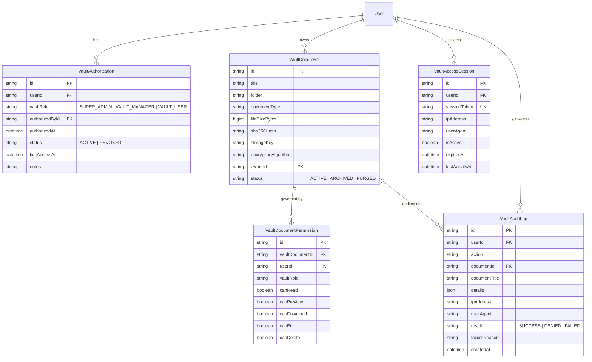

# DCC Enterprise — Private Vault Module Implementation & Security Report

## 1. Executive Summary

The **Private Vault** has been engineered and integrated into the DCC Enterprise WebApp (`C:\Users\earlj\Desktop\DCC V2` and synchronized with `C:\Users\earlj\Desktop\DCC`). It is a true security-controlled document repository rather than a visual folder filter, featuring:

* **Independent Backend Authorization**: Access to the vault is strictly gated by Super Admin authorization. Unauthorized users receive `403 ACCESS DENIED` with security audit logging.
* **Identity Verification via Existing DCC Password**: When authorized, users authenticate using their own DCC account password (`bcrypt.compare` against `User.passwordHash`). No separate passwords are stored or created, and plain passwords are never logged.
* **15-Minute Auto-Lock & Sliding Window Session**: Authenticated unlock generates an ephemeral 32-byte cryptographically secure session token (`VaultAccessSession`) with a 15-minute sliding inactivity window.
* **Immediate Revocation Enforcement**: Revoking a user's vault privileges immediately terminates active sessions and blocks requests across both web and native tools.
* **Document-Level Granular Permissions**: Documents maintain granular control for `canRead`, `canPreview`, `canDownload`, `canEdit`, and `canDelete`.
* **Isolated Object Storage**: Documents deposited into the vault are stored in an isolated physical directory (`.server_object_storage/nkb-documents/vault/...`), never placed in the public web root, and only served via authorized binary streams.
* **Immutable Tamper-Evident Audit Trail**: Every access attempt, unlock success/failure, auto-lock, preview, download, upload, deletion, authorization, and revocation is recorded in `VaultAuditLog`.
* **Super Admin Management Interface**: Integrated into `Settings › Private Vault Access` to authorize users, revoke access, and review the live immutable audit trail.
* **Windows Explorer Context Menu Integration**: `DccUploadWindow.ps1` and `dcc-upload-cli.mjs` support target repository selection (`Normal DCC Documents` vs `🔐 Private Vault`) with real-time DCC credential validation.
* **Zero Disruption to Existing DCC Modules**: Standard document register, batch uploads, scanner agent, BullMQ, OCR, routing, and archive features remain 100% untouched and operational.

---

## 2. Database Schema Additions

Five dedicated relational tables were pushed to PostgreSQL (`nkb_scanner_db`):



---

## 3. Architecture & API Endpoints

The Private Vault API is mounted under `/api/v1/vault`:

| Endpoint | Method | Middleware | Description |
| :--- | :--- | :--- | :--- |
| `/api/v1/vault/status` | `GET` | `authenticate` | Checks user's Vault authorization status and active session countdown |
| `/api/v1/vault/unlock` | `POST` | `authenticate` | Verifies user's DCC password, manages rate limits, and issues session token |
| `/api/v1/vault/lock` | `POST` | `authenticate` | Invalidates current vault session immediately |
| `/api/v1/vault/documents` | `GET` | `authenticate`, `requireVaultSession` | Lists authorized confidential documents |
| `/api/v1/vault/documents` | `POST` | `authenticate`, `requireVaultSession` | Securely uploads document with SHA-256 integrity |
| `/api/v1/vault/documents/:id` | `GET` | `authenticate`, `requireVaultSession` | Retrieves document metadata and effective permissions |
| `/api/v1/vault/documents/:id/preview` | `GET` | `authenticate`, `requireVaultSession` | Streams inline preview with restricted headers |
| `/api/v1/vault/documents/:id/download` | `GET` | `authenticate`, `requireVaultSession` | Streams secure download attachment |
| `/api/v1/vault/documents/:id/delete` or `DELETE` | `DELETE` | `authenticate`, `requireVaultSession` | Purges physical file and database records |
| `/api/v1/vault/admin/users` | `GET` | `authenticate`, `requireVaultSuperAdmin` | Lists all DCC users with Vault authorization statuses |
| `/api/v1/vault/admin/users/authorize` | `POST` | `authenticate`, `requireVaultSuperAdmin` | Grants `VAULT_MANAGER` or `VAULT_USER` privileges |
| `/api/v1/vault/admin/users/revoke` | `POST` | `authenticate`, `requireVaultSuperAdmin` | Revokes access and immediately kills all active sessions |
| `/api/v1/vault/audit-logs` | `GET` | `authenticate`, `requireVaultSuperAdmin` | Retrieves paginated immutable audit trail |

---

## 4. Web Application Workflow

### 4.1. Unauthorized State
When an authenticated user lacks Vault authorization and navigates to `🔐 Private Vault`:
* The backend returns `{ authorized: false, status: 'UNAUTHORIZED' }`.
* The client renders an explicit **403 ACCESS DENIED** card with clear security notices.
* The attempt is audited as `VAULT_ACCESS_DENIED`.

### 4.2. Locked Authentication State
When an authorized user navigates to `🔐 Private Vault`:
* The client presents the **Unlock Private Vault** credential prompt.
* User submits their standard DCC password.
* Backend verifies password via `bcrypt.compare`.
* 5 failed attempts locks the user out of the vault for 15 minutes (`429 Too Many Requests`).
* Successful verification issues a 32-byte session token stored in `sessionStorage` (`dcc_vault_token`).

### 4.3. Unlocked Workspace & Document Explorer
* **Header Bar**: Live countdown timer (`Auto-lock in: 14:59`), active role badge, manual `Lock Vault` button, and `+ Secure Upload` button.
* **Client Auto-Lock**: A 1-second interval tracker counts down remaining session seconds and monitors keyboard/mouse activity. On 15 minutes of inactivity or token expiry, the session is cleared client-side and locked on the backend.
* **Document Explorer**: Folder navigation (`/Executive`, `/Financial`, `/Legal`, `/Board`, `/HR_Confidential`, `/General`), live text search, SHA-256 verification hash, inline preview, download, and permanent deletion controls.

### 4.4. Super Admin User & Audit Controls
Under `Settings › Private Vault Access`:
* Table listing all users, their Vault status (`ACTIVE`, `REVOKED`, `UNAUTHORIZED`), assigned role, authorized date, authorized by, and last access timestamp.
* **Authorize User Modal**: Assigns `VAULT_MANAGER` or `VAULT_USER`.
* **Revoke Modal**: Immediately revokes access and purges all active session tokens.
* **Immutable Audit Trail Viewer**: Fullscreen modal displaying chronological audit entries with action, user, document, result, IP, and reason.

---

## 5. Windows Explorer Right-Click Integration

`DccUploadWindow.ps1` and `dcc-upload-cli.mjs` have been upgraded:
* **Destination Target**: Radio buttons to choose between:
  * `(•) 📄 Normal DCC Documents`
  * `( ) 🔐 Private Vault`
* When `Private Vault` is selected:
  * Reveals **Vault Storage Folder** dropdown (`/Executive`, `/Financial`, `/Legal`, etc.).
  * Reveals **DCC Account Password** password box.
* On upload:
  1. Checks user authorization at `GET /api/v1/vault/status`.
  2. Unlocks vault session using password at `POST /api/v1/vault/unlock`.
  3. Transmits files via `POST /api/v1/vault/documents` with SHA-256 hashing.
  4. If unauthorized or invalid password, raises a blocking error alert and halts upload.

---

## 6. Verification & Automated Test Results

The test suite in `apps/api/src/__tests__/private_vault.test.ts` was executed against live PostgreSQL and Redis services:

```text
▶ Private Vault Enterprise Security Module Tests
  ✔ 1. should deny Private Vault access to unauthorized user (403 ACCESS DENIED) (25.5ms)
  ✔ 2. should verify DCC password and reject invalid password attempt (87.2ms)
  ✔ 3. should verify correct DCC password, grant access, and issue a 15-min session token (109.8ms)
  ✔ 4. should auto-lock session when 15-minute inactivity expires (29.1ms)
  ✔ 5. should immediately terminate active session and deny access upon revocation by Super Admin (152.9ms)
  ✔ 6. should upload, stream preview, download, and delete confidential documents securely (58.3ms)
  ✔ 7. should maintain an immutable audit trail queryable by Super Admin (26.8ms)
  ✔ 8. should verify regular DCC document repository remains intact and independent (8.4ms)
✔ Private Vault Enterprise Security Module Tests (1016.4ms)
ℹ tests 8, pass 8, fail 0
```
